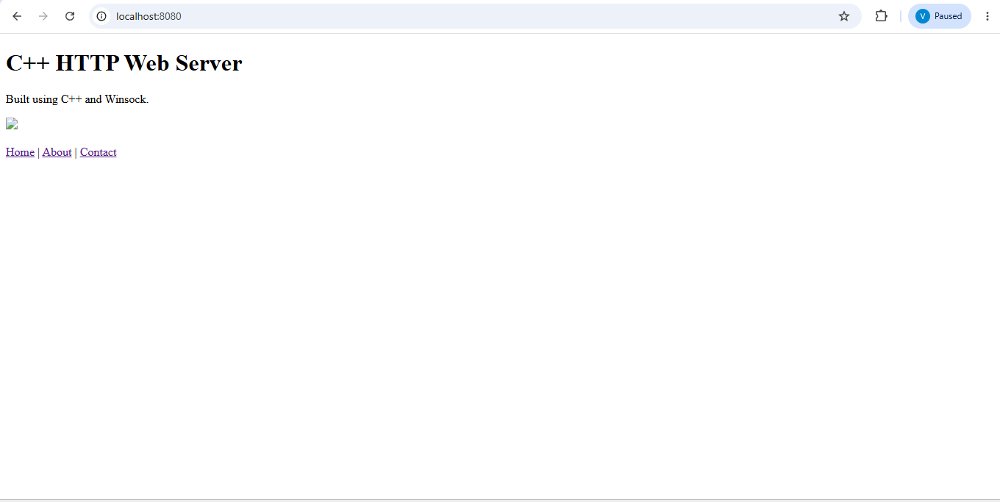
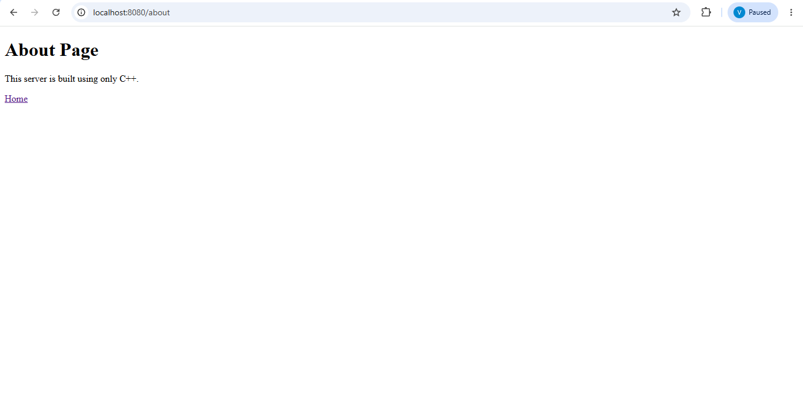
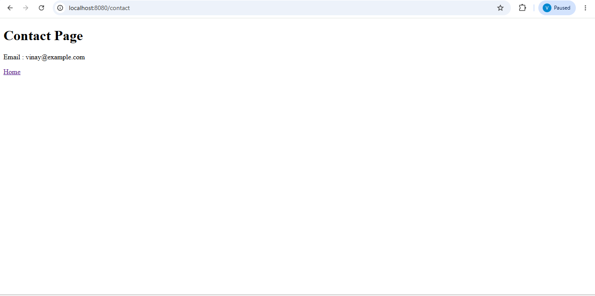

# 🌐 HTTP Web Server in C++

A lightweight HTTP Web Server developed in **C++** using the **Winsock2 API**. The server listens for incoming HTTP requests, processes them using TCP socket programming, and serves static web content such as HTML pages, CSS files, and images.

---

## 📌 Features

- HTTP Server built from scratch in C++
- TCP Socket Programming using Winsock2
- HTML page serving
- CSS file support
- PNG image support
- URL Routing
- Custom 404 Error Page
- Request logging
- Lightweight architecture
- No external frameworks

---

## 🛠 Technologies Used

- C++
- Winsock2
- TCP/IP
- HTTP Protocol
- HTML5
- CSS3
- Visual Studio Code
- Git & GitHub

---

## 📂 Project Structure

```
HTTP-Web-Server/
│
├── include/
│
├── src/
│   └── main.cpp
│
├── public/
│   ├── index.html
│   ├── about.html
│   ├── contact.html
│   ├── 404.html
│   ├── css/
│   │   └── style.css
│   └── images/
│       └── logo.png
│
├── logs/
│   └── server.log
│
├── README.md
└── .gitignore
```

---

## 🚀 How to Compile

```bash
g++ .\src\main.cpp -o server.exe -lws2_32
```

---

## ▶️ Run the Server

```bash
.\server.exe
```

---

## 🌍 Open in Browser

```
http://localhost:8080
```

---

## 📄 Available Routes

| Route | Description |
|-------|-------------|
| / | Home Page |
| /about | About Page |
| /contact | Contact Page |
| Any invalid URL | Custom 404 Page |

---

## ⚙️ How It Works

1. Initializes Winsock.
2. Creates a TCP socket.
3. Binds to port **8080**.
4. Waits for client connections.
5. Receives HTTP requests.
6. Identifies the requested route.
7. Loads the corresponding HTML file.
8. Sends an HTTP response to the browser.
9. Logs the request.
10. Closes the client connection.

---
## 📸 Screenshots

### Home Page



---

### About Page



---

### Contact Page



---

### 404 Error Page


---

## 🔮 Future Improvements

- Multi-threading
- HTTPS Support
- MIME Type Detection
- Configuration File
- Better Logging
- File Upload Support
- REST API Support

---

## 👨‍💻 Author

**Vinay Kumar S K**

GitHub:
https://github.com/vinay-kumar-sk

---

## 📜 License

This project is created for educational and learning purposes.
